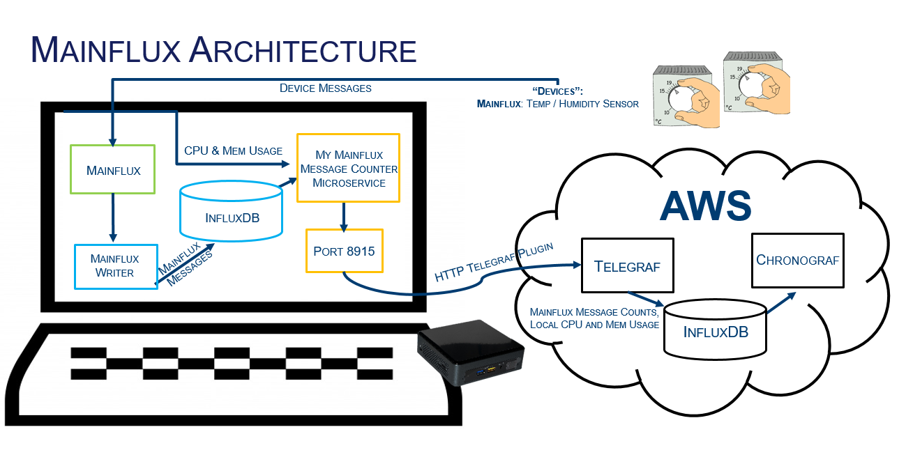
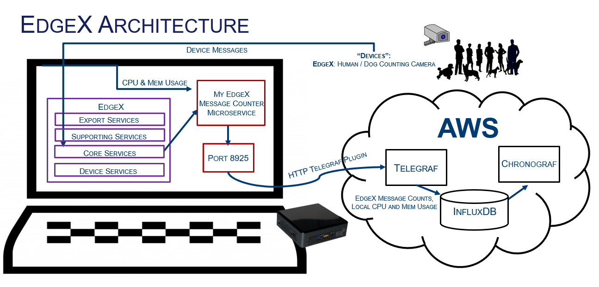

# View Metering in Action on Edge Middleware Platforms
By Katie Nguyen | August 2019

**What is metering, and why is it important?**

While metering is simply the act of measuring and recording the quantity of something, it has large scale applications that are key to certain business ventures. For instance, metering is often used for billing purposes where a company is tracking the usage of products and services on a monthly basis. For example, metering can be utilized to record the amount of water used in a house or the amount of time between temperature updates from a sensor. Beyond monitoring usage rates in order to bill customers accordingly, metering also allows customers to track how they are spending their money and utilizing resources in real-time. This data can also be used to observe historical patterns in a customer’s utilization in order to aid in the adjustment of their future choices.

**What does metering look like on edge middleware platforms?**

In order to view metering in action, I have developed a simple cloud based metering solution for edge middleware platforms, specifically Mainflux and EdgeX. The solution consists of add-on microservices that look at incoming messages from preconfigured devices, which are connected to each platform. The services then query how many of each type of message has been sent to the platform from a specific device. Finally, the services output the counts of each message type as well as local CPU and memory usage to a designated port. These message counts can be collected and graphed with the setup of Telegraf, InfluxDB, and Chronograf. Through modifying the Telegraf configuration file, the message counts and system info can be consumed into InfluxDB via the HTTP input plugin. From there, the data can be visualized in Chronograf to track specific message counts as well as local system info. The TIC stack can be setup locally or in the cloud depending on individual implementations. The two services work independently of one another or can be run simultaneously if so desired.

**How to get started:**

**Mainflux:**
- Run Mainflux via Docker (https://github.com/mainflux/mainflux/)
  - Clone mainflux repo, cd into it, run ```make run```
- Use the CLI to setup devices and channels for actual or simulated devices (https://mainflux.readthedocs.io/en/latest/getting-started/)
  - Copy link to cli from releases page on Mainflux GitHub: ```wget LINK```
  - ```tar xvf TAR-FILE```
  - Create user: ```./mainflux-cli users create test@example.com test```
  - Get user token: ```./mainflux-cli users token test@example.com test```
  - Export user token: ```export USERTOKEN=user-token-from-above```
  - Create thing: ```./mainflux-cli things create '{"type": "device", "name" "testThing"}' $USERTOKEN```
  - Get info about thing: ```./mainflux-cli things get all $USERTOKEN```
  - Create channel: ```./mainflux-cli channels create '{"name": "testChannel"}' $USERTOKEN```
  - Get channel info: ```./mainflux-cli channels get all $USERTOKEN```
  - Connect channel to thing: ```./mainflux-cli things connect THINGID CHANNELID $USERTOKEN```
- Send messages from the device across Mainflux
  - Use the CLI to send messages if the device is simulated
    - ```./mainflux-cli messages send CHANNELID '[{"bn":"Dev1", "n":"temp", "v":20}, {"n":"hum","v":34}]' THINGKEY```
- Start the Mainflux -> InfluxDB writer service via Docker(https://github.com/mainflux/mainflux/tree/master/writers/influxdb)
- Start the Mainflux Metering Microservice via Docker
  - Add environmental variables into Docker file before running
    - Example Configuration: replace with correct IP Address
    ```yml
    PORT: 8915
    DEV1READ1: Dev1hum
    DEV1READ2: Dev1temp
    DEVICE1: dev1
    ADDR: http://{IP_Address}:8086
    ```
  - ```docker-compose up -d```
- Navigate to localhost:8915 to view message counts & system info
- Install Telegraf and Chronograf (https://portal.influxdata.com/downloads/)
  - Install InfluxDB if Mainflux / Mainflux Writer is not running on the same system 
  - InfluxDB is already running through the Mainflux writer service if it is running
- Configure the HTTP Telegraf input plugin to look at localhost:8915 with a timeout time of 10 seconds and an input format of 'json' (https://github.com/influxdata/telegraf/tree/master/plugins/inputs/http)
  - Telegraf configuration file is located in /etc/telegraf/telegraf.conf
- Restart Telegraf and attach Chronograf to the InfluxDB on port 8086
  - ```sudo systemctl restart telegraf```
  - Chronograf can be launched from localhost:8888
- Create Chronograf graphs to visualize Mainflux device message count data and system info by creating a new dashboard



**EdgeX:**
- Run EdgeX via Docker Compose (https://docs.edgexfoundry.org/Ch-QuickStart.html)
- Setup a device with the platform 
  - If creating a simulated device: (https://docs.edgexfoundry.org/Ch-Walkthrough.html)
- Start the EdgeX Metering Microservice via Docker 
  - Add environmental variables into Docker file before running
    - Example Configuration: replace with correct IP Address
    ```yml
    PORT: 8925
    READING1: caninecount
    READING2: humancount
    DEVICE: countcamera1
    READING_REQUEST1: http://{address}:48080/api/v1/reading/name/caninecount/10000
    READING_REQUEST2: http://{address}:48080/api/v1/reading/name/humancount/10000
    EVENT_REQUEST: http://{address}:48080/api/v1/event/count/countcamera1
    ```
  - ```docker-compose up -d```
- Send messages from the device
  - ```curl -X POST http://localhost:48080/api/v1/event -d '{"device":"countcamera1","readings":[{"name":"caninecount","value":"3"}, {"name":"humancount","value":"2"}]}' ```
- Navigate to localhost:8925 to view message counts & system info
- Install Telegraf, InfluxDB, & Chronograf (https://portal.influxdata.com/downloads/)
- Configure the HTTP Telegraf input plugin to look at localhost:8925 with a timeout of 10 seconds and an input format of 'json' (https://github.com/influxdata/telegraf/tree/master/plugins/inputs/http)
  - Telegraf configuration file is located in /etc/telegraf/telegraf.conf
- Restart Telegraf and attach Chronograf to InfluxDB on port 8086
  - ```sudo systemctl restart telegraf```
  - Chronograf can be launched from localhost:8888
- Create Chronograf graphs to visualize EdgeX device message count data and system info by creating a new dashboard



**AWS:**
- Start EC2 instance
- Adjust the instance's security group settings to allow an inbound rule on port 8888 (tcp protocol)
- SSH into instance and forward ports that are being used by microservice(s)
- Install Telegraf, InfluxDB, and Chronograf (https://portal.influxdata.com/downloads/)
- Configure the Telegraf HTTP input plugin to look at localhost:8915 and/or localhost:8925 with a timeout of 10 seconds and an input format of 'json' (https://github.com/influxdata/telegraf/tree/master/plugins/inputs/http)
  - The Telegraf configuration file can be found in /etc/telegraf/telegraf.conf
- Restart Telegraf
  - ```sudo systemctl restart telegraf``` 
- Navigate to the instance's IP:8888 and configure Chronograf in a browser to point to the InfluxDB instance at localhost:8086
- Create a new dashboard in Chronograf 
- Click on the "Add a Cell to Dashboard" button 
  - Select telegraf.autogen
  - Select http -> url -> pick the designated URL for the graph you wish to configure -> click on the appropriate field that you wish to monitor 
  - Alter the timeframe of the dashboard as needed (e.g. time > now() - 30m)
  - Title the graph accordingly and change the colors in the Visualization tab 
- Repeatedly add cells to the dashboard as needed to track various message counts and system info from Mainflux and/or EdgeX 

**How does it work if you want to monitor multiple devices?**

As it currently stands, each microservice is capable of monitoring one device with two readings (e.g. a senor with temperature and humidity readings). The microservices can be reconfigured to monitor multiple devices with various readings, but not without altering and adding multiple lines of code. However, a simpler solution to monitoring multiple devices is to launch multiple microservices on different ports, which can be configured in the Docker/Docker Compose configuration files.

**What if my device has less than or more than two readings?**

Since the services are currently setup to track devices with two readings, some code modification is needed to track devices with less than or more than two readings. However, the changes are minimal and can be completed through following the tutorial below.

**Mainflux:**
- Add additional variables in both the code and Docker configuration files
  - Ex: messages.go
  ```go
   // var declarations at top of code
   var dev1read1, dev1read2, dev1read3 json.Number
   var address, dev1read1Name, dev1read2Name, dev1read3Name string

   // top of main() in the rest of the enviro var declarations
   dev1read3Name = os.Getenv("DEV1READ3")

   // top of HandleFunc with other int conversions
   dev1read3Int, err3 := strconv.ParseUint(dev1read3.String(), 10, 64)
   if err1 == nil && err2 == nil && err3 == nil {
       dev1Msg = dev1read1Int + dev1read2Int + dev1read3Int
   }

   // bottom of the file with other output statements
   fmt.Fprintf(w, "\"%v Messages\": %v,\n", dev1read2Name, dev1read2)
   fmt.Fprintf(w, "\"%v Messages\": %v,\n", dev1read3Name, dev1read3)
   ```
  - Ex: docker-compose.yml
  ```yml
  environment:
    PORT: 8915
    DEV1READ1: Dev1hum
    DEV1READ2: Dev1temp
    DEV1READ3: Dev1time
    ...
  ```
- Add an additional query in the code 
 ```go
  q = client.NewQuery(fmt.Sprintf("SELECT count(value) FROM messages WHERE \"name\"='%v'", dev1read3Name), "mainflux", "")
	if response, err := c.Query(q); err == nil && response.Error() == nil {
		if len(response.Results[0].Series) == 0 {
			dev1read3 = `0`
		} else {
			tempVal := response.Results[0].Series[0].Values[0]
		    dev1read3 = tempVal[countIndex].(json.Number)
		}
	}

  ```

**EdgeX:** 
- Add additional variables in both the code and Docker configuration files
  - Ex: messages.go
  ```go
  // top of the file with the rest of the variable declarations
  var reading1Count, reading2Count, reading3Count, ... int
  var reading_request1, reading_request2, reading_request3, ... string

  // near the end of the query function
  totalDeviceCounts = reading1Count + reading2Count + reading3Count

  // top of main()
  var reading1, reading2, reading3, ... string
  reading3 = os.Getenv("READING3")
  reading_request3 = os.Getenv("READING_REQUEST3")

  //in HandleFunc after query() call
  fmt.Fprintf(w, "\"%v Messages\": %v,\n", reading3, reading3Count)
  ```
  - Ex: docker-compose.yml
  ```yml
  environment:
    PORT:8925
    READING1:caninecount
    READING2:humancount
    READING3:catcount
    ...
    READING_REQUEST3:http://{address}:48080/api/v1/reading/name/catcount/10000
    ...
  ```
- Add an additional query in the code
```go
  resp, err = http.Get(fmt.Sprintf("%s", reading_request3))
	if err != nil {
		reading3Count = 0
	}
	defer resp.Body.Close()
	body, err = ioutil.ReadAll(resp.Body)
	if err != nil {
		reading3Count = 0
	}
	reading3Count = (len(body) / msg_size) 
```
  
**Future Enhancements:**

This simple metering microservice allows for the monitoring of device messages on edge middleware platforms; however, this project can eventually be expanded to provide a more comprehensive solution. For example, this metering data can eventually be used as a source of control in a rules engine. EdgeX currently has a rules engine already implemented in its architecture, or Kapacitor can be utilized for this purpose. Kapacitor is the fourth component of the TICK stack that is used in conjunction with Telegraf, InfluxDB, and Chronograf. It features an alerting system that is also capable of performing certain tasks, such as controlling IoT devices. In this regard, these engines can be utilized to filter/meter exceptions or other anomalies in the incoming data to InfluxDB from the microservices.

Additionally, as it is previously mentioned above, the current setup of the microservices allows for the monitoring of one device with two readings. Eventually, it would be worthwhile to restructure the services so that they are capable of monitoring multiple devices from the same microservice, all with an arbitrary number of readings. This restructuring would allow for all data collected from the microservices to be communicated to AWS from one http port, rather than several. In practice, these readings and devices would be configurable from the Docker configuration file, without having to alter any source code.  

